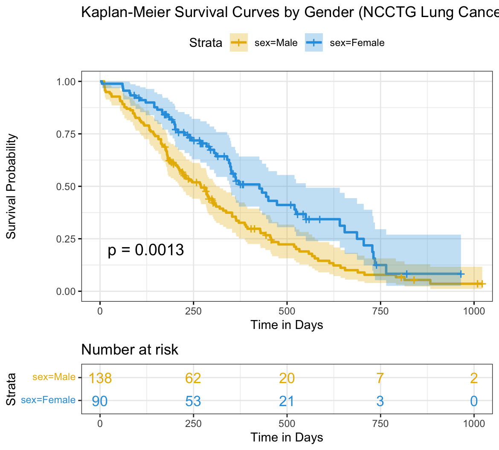

# HEOR & RWE Analytics: Survival Analysis of Lung Cancer Cohort

## Project Overview
This repository demonstrates a foundational quantitative workflow used in **Health Economics and Outcomes Research (HEOR)** and **Real-World Evidence (RWE)** generation. 

Using R, this project conducts a Kaplan-Meier survival analysis on the NCCTG advanced lung cancer dataset. The primary objective is to evaluate survival probabilities across different patient cohorts (stratified by gender) to simulate the clinical data processing phase required for building Cost-Effectiveness Models (e.g., Markov Models) for Health Technology Assessment (HTA) submissions.

## Visual Output

## Methodology
*   **Data Source:** NCCTG Lung Cancer Dataset (Standard clinical trial/RWE proxy data).
*   **Programming Language:** R
*   **Core Packages:** `survival` (for statistical modeling), `survminer` (for clinical visualization).
*   **Statistical Approach:** 
    *   Constructed a survival object capturing 'time to event' and 'censoring' status.
    *   Fitted a Kaplan-Meier estimate to map survival probabilities over time.
    *   Performed a **Log-rank test** to determine the statistical significance of the clinical covariate (gender) on Overall Survival (OS).

## Key Findings & HEOR Implications
*   **Cohort Variance:** The analysis reveals a statistically significant difference in overall survival between male and female cohorts (p = 0.0013). 
*   **Modeling Implication:** Because gender significantly impacts the baseline survival hazard, any subsequent state-transition model (Markov or Partitioned Survival Model) evaluating a novel oncology therapy in this indication must be stratified by gender. Using a blended baseline hazard would result in inaccurate Quality-Adjusted Life Year (QALY) estimations and skew the Incremental Cost-Effectiveness Ratio (ICER).

## Repository Contents
*   `survival_analysis.R`: The complete, fully commented R script detailing the data preparation, modeling, and plotting process.
*   `survival_curve.png`: The graphical output, including the clinical "Number at risk" table essential for HTA dossiers.
